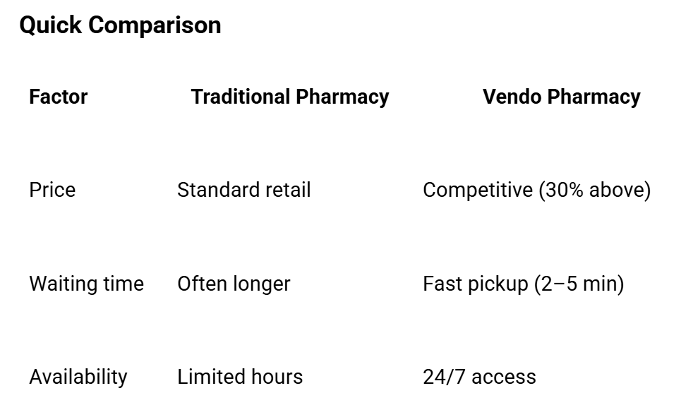

Price
Prices are set approximately 30% higher than standard retail pharmacies to cover 24/7 availability, secure dispensing infrastructure, convenient locations, and maintenance costs. Customers are paying for convenience, time savings, and accessibility rather than just the medication itself.
Value to Customers
•	24/7 access and shorter waiting time
•	Faster repeat-medication collection via secure dispensing lockers
•	Guided self-care support for OTC products (non-diagnostic)
Market Price Benchmark
•	Prices are 30% above community pharmacy price points
•	No significant markup compared to retail pharmacies
Discounts
•	Hospital referral vouchers for repeat secure locker users
Quick Comparison
 this is a table