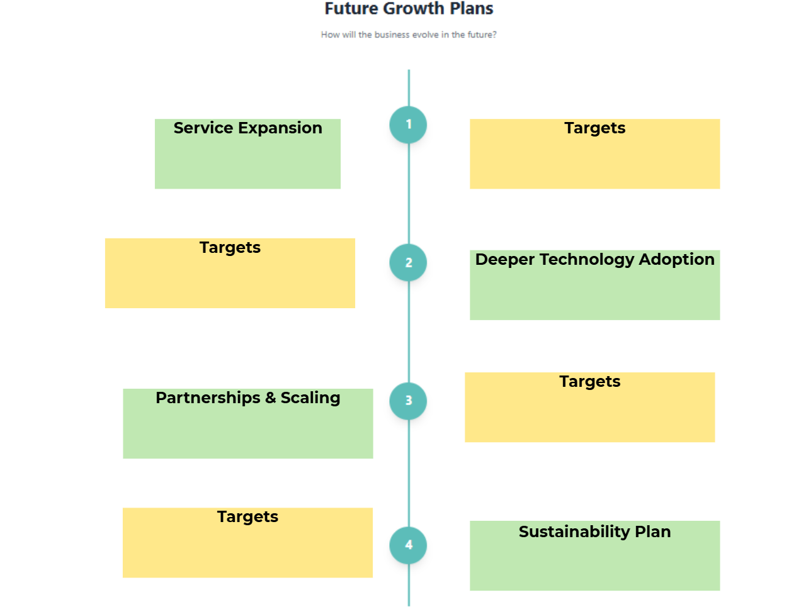

1) Service Expansion
Community Health Support
•	Expand into community health support (e.g., BP kiosks, wellness checks, seasonal campaigns).
•	Deploy self-service kiosks with automated interpretation and referral prompts.
o	If abnormal readings are detected, the system triggers referral prompts (e.g., “Please consult a GP” or book appointment with partner clinic).
•	Run quarterly health campaigns with digital education and QR resources.
Repeat-Medication Locker Collection to Enhance Adherence
•	Secure integration with hospitals/polyclinics.
o	Prescription data is digitally linked to the locker system. Once medication is prepared, patients receive SMS/app reminders when it is ready for collection.
Missed-collection alerts + pharmacist follow-up
•	If medication is not collected within 48 hours, the system automatically triggers an SMS reminder.
•	If still uncollected after 72 hours, a second reminder is sent and flagged in the dashboard.
•	After 5 days, high-risk patients are escalated for pharmacist review to check on adherence, side effects, or barriers to collection.
Travel Health Expansion
•	AI-curated destination kits.
o	The system suggests tailored bundles based on travel destination. Prompts may include mosquito protection, GI medications, altitude support, or vaccine reminders.
•	Embed short digital counselling before purchase to ensure appropriate product selection and safe self-care.

Targets
•	Install BP kiosks at pilot sites within 6 months; achieve ≥20% referral rate within 12 months
•	Onboard first hospital partner within 6 months; reduce missed pickups by ≥25% within 12 months
•	Launch ≥5 travel bundles within 9 months; increase basket size by ≥20% within 12 months
________________________________________
2) Deeper Technology Adoption
VendAI Enhancement
•	Enhance VendAI into a structured guided self-care pathway.
•	Embed red-flag triage and tele-pharmacist escalation.
•	Standardise counselling prompts for safe, consistent advice.
Predictive Maintenance and Uptime
•	Improve predictive maintenance and uptime.
•	Use IoT diagnostics and AI analytics for early fault detection.
Data Security and Traceability
•	Strengthen data security and traceability.
•	Implement encrypted logs, digital signatures, audit trails, and PDPA-aligned access controls.

Targets
•	Implement 100% red-flag triage across machines within 6 months
•	Achieve ≥95% machine uptime within 12 months; reduce breakdowns by ≥40% within 18 months
•	Ensure 100% encrypted, time-stamped prescription logs within 6 months
________________________________________
3) Partnerships & Scaling
Healthcare Partnerships
•	Expand collaborations with polyclinics, GPs, and hospitals.
Locker Collection During Consultation
•	Offer locker-based medication collection as an alternative to pharmacy queues.
•	Digital prescription transfer + SMS notification for convenient pickup.
Adherence Programmes
•	Co-develop adherence programmes.
•	Enrol chronic patients (e.g., diabetes, hypertension) into structured refill reminder systems.
•	Trigger pharmacist follow-up for missed pickups or high-risk patients.
Supplier Partnerships
•	Grow supplier partnerships.
•	Strengthen supplier partnerships (e.g., manufacturers and wholesalers) through volume-based contracts and shared inventory dashboards with FEFO tracking to improve cost efficiency and reduce wastage.
Deployment Strategy
•	Deploy machines in clusters.
•	Deploy machines in high-demand clusters (e.g., dense housing estates, transport nodes, hospital-adjacent sites) using demand heat-mapping to optimise utilisation and logistics efficiency.

Targets
•	Onboard ≥10 institutional partners within 24 months
•	Reduce procurement costs by 5–10% within 18 months
•	Deploy in ≥3 clusters within 12 months; increase utilisation by ≥25% within 18 months
________________________________________
4) Sustainability Plan
Reduce Wastage and Carbon Footprint
•	Reduce wastage and carbon footprint.
•	Use AI forecasting with FEFO and structured pharmaceutical waste channels.
Lower Operational Emissions
•	Lower operational emissions.
•	Optimise refill logistics and adopt energy-efficient, smart temperature-controlled machines.

Targets
•	Reduce expiry losses by ≥30% within 18 months
•	Cut logistics fuel use by ≥15% within 12 months
•	Reduce energy usage per machine by ≥20% within 24 months

 - this picture shows how i want to arrange the information